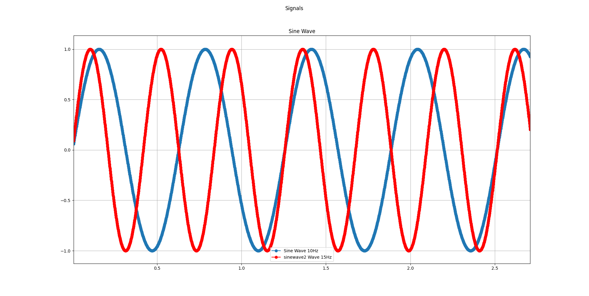
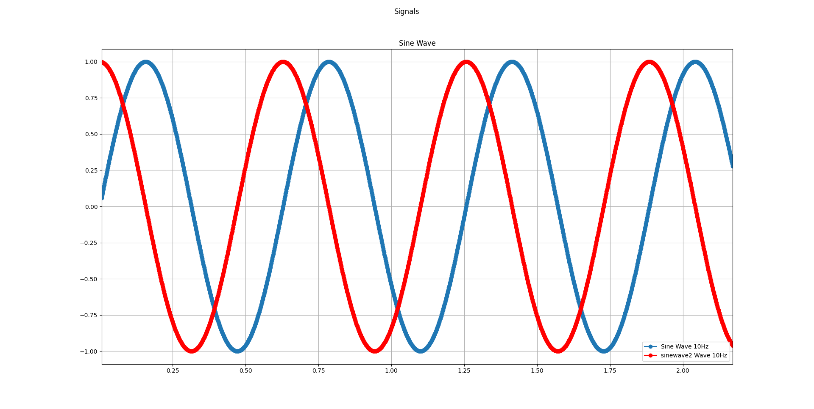
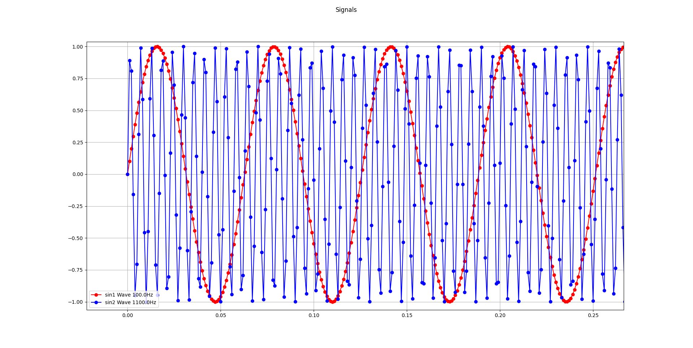
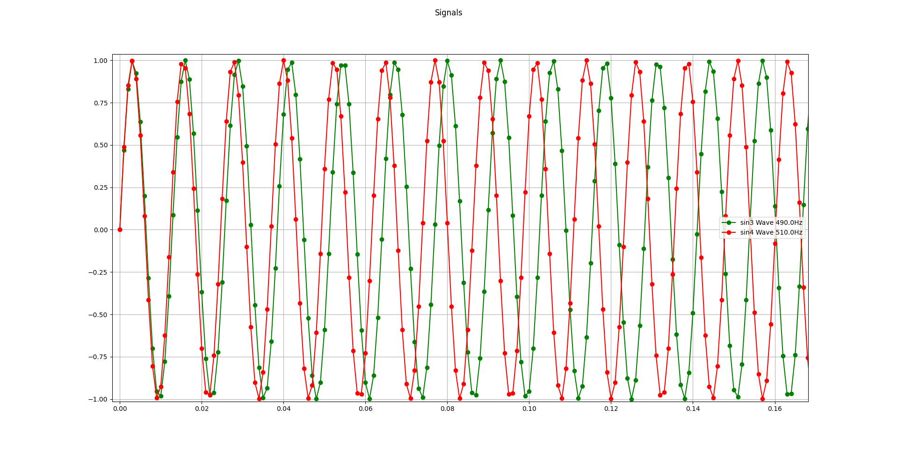

### Codigo de simulación 

```python
# ---------------- README ----------------------------
# To start the simulation you have two options
# 1) using ipython:
# - ipython -i simulation.py
# 2) from plt.show(block=False) change block=True
# ----------------------------------------------------

import numpy as np
import matplotlib.pyplot as plt

FS = 10000
F0 = 10
FASE = 0
MUESTRAS = 10000
AMP = 1
COLUMNS = 1
ROWS = 1

signals = {
    "sine" :    {
                    "freq0"     : 0.1*1000,
                    "freqS"     : 1000,
                    "muestras"  : 1000,
                    "amp"       : 1,
                    "fase"      : 0,
                },
    "sin1" :    {
                    "freq0"     : 0.1*1000,
                    "freqS"     : 1000,
                    "muestras"  : 10000,
                    "amp"       : 1,
                    "fase"      : 0,
                    "color"     : 'red'
                },
    "sin2" :    {
                    "freq0"     : 1.1*1000,
                    "freqS"     : 1000,
                    "muestras"  : 10000,
                    "amp"       : 1,
                    "fase"      : 0,
                    "color"     : 'blue'
                },
    "sin3" :    {
                    "freq0"     : 0.49*1000,
                    "freqS"     : 1000,
                    "muestras"  : 10000,
                    "amp"       : 1,
                    "fase"      : 0,
                    "color"     : "green"
                },
    "sin4" :    {
                    "freq0"     : 0.51*1000,
                    "freqS"     : 1000,
                    "muestras"  : 10000,
                    "amp"       : 1,
                    "fase"      : 0,
                    "color"     : "red"
                },
    "square":   {
                    "freq0"     : 100,
                    "freqS"     : 1000,
                    "muestras"  : 10000,
                    "amp"       : 1,
                    "color"     : 'blue'
                },
    "tri":      {
                    "freq0"     : 10,
                    "freqS"     : 1000,
                    "muestras"  : 10000,
                    "amp"       : 1,
                    "color"     : 'blue'
                }
}


class Signals():
    def __init__(self):
        self.fs = FS
        self.f0 = F0
        self.muestras = MUESTRAS
        self.amp = AMP

    def __create_figure(self):
        self.fig, self.ax = plt.subplots(ROWS, COLUMNS, figsize=(8,4.5), squeeze=False)
        plt.suptitle("Signals")
    
    def __figure_show(self):
        plt.grid(True)
        plt.legend()
        plt.show(block=False)

    def create_sine_wave(self, signal_dict = signals):
        
        # Get values from dictionary to plot the sine wave
        freq0 = signal_dict["sine"]['freq0']
        freqS = signal_dict["sine"]['freqS']
        muestras = signal_dict["sine"]['muestras']
        amplitude = signal_dict["sine"]['amp']
        phase = signal_dict["sine"]['fase']

        # Set the title for the sine wave
        self.ax[0][0].set_title("Sine Wave")

        # ---------------------- EJEMPLO DE NP.ARANGE ---------------------------------------------------------
        # muestras/freqS = 10000/1000 = 10
        # 1/freqS = 1/1000 = 0.001
        # np.arrange va a crear un array de 0 a 10 (muestras/freqS) en pasos de 1/freqS que es Ts.
        # Ts es el tiempo que pasa entre muestra y muestra. Entre 0 y 10 con pasos de 0.001 hay 10000 muestras.
        # -----------------------------------------------------------------------------------------------------
        self.x = np.arange(0, muestras/freqS, 1/freqS)

        # np.sin is a sine function
        self.y = np.sin(self.x*freq0 + phase)

        self.amp = amplitude
        self.ax[0][0].set_ylim(-self.amp*2, self.amp*2)
        self.ax[0][0].set_xlim(0, 10)
        self.ax[0][0].plot(self.x, self.y*self.amp, 'o-', label = 'Sine Wave {}Hz'.format(freq0))
    
    def create_square_wave(self, signal_dict = signals):

        # Get values from dictionary to plot the square wave
        freq0 = signal_dict["square"]['freq0']
        freqS = signal_dict["square"]['freqS']
        muestras = signal_dict["square"]['muestras']
        amplitude = signal_dict["square"]['amp']

        self.ax[0][0].set_title("Square Wave")
        self.x = np.arange(0, muestras/freqS, 1/freqS)
        self.amp = amplitude
        self.y = self.amp * (np.sign(np.sin(2 * np.pi * freq0 * self.x)) + 1) / 2
        self.ax[0][0].set_ylim(-self.amp*2, self.amp*2)
        self.ax[0][0].set_xlim(0, 1)
        self.ax[0][0].plot(self.x, self.y*self.amp, 'o-', label = 'Square Wave {}Hz'.format(freq0))
    
    def create_triangular_wave(self, signal_dict = signals):
        
        # Get values from dictionary to plot the triangular wave
        freq0 = signal_dict["tri"]['freq0']
        freqS = signal_dict["tri"]['freqS']
        muestras = signal_dict["tri"]['muestras']
        amplitude = signal_dict["tri"]['amp']

        self.ax[0][0].set_title("Triangular Wave")
        self.x = np.arange(0, muestras/freqS, 1/freqS)
        self.amp = amplitude
        self.y = self.amp * (2 * np.abs((self.x * freq0) % 1 - 0.5) - 0.5)
        self.ax[0][0].set_ylim(-self.amp*2, self.amp*2)
        self.ax[0][0].set_xlim(0, 1)
        self.ax[0][0].plot(self.x, self.y*self.amp, 'o-',label = 'Triangular Wave {}Hz'.format(freq0))

    def add_signal(self, signal_dict, signal_name, signal_type):

        # Get values from dictionary to plot the sine wave
        freq0 = signal_dict[signal_name]['freq0']
        freqS = signal_dict[signal_name]['freqS']
        muestras = signal_dict[signal_name]['muestras']
        amplitude = signal_dict[signal_name]['amp']

        x = np.arange(0, muestras/freqS, 1/freqS)

        # np.sin is a sine function
        if signal_type == 'sin':
            phase = signal_dict[signal_name]['fase']
            y = np.sin(x*freq0 + phase)
        elif signal_type == 'square':
            y = amplitude * (np.sign(np.sin(2 * np.pi * freq0 * x)) + 1) / 2
        else:
            y = amplitude * (2 * np.abs((x * freq0) % 1 - 0.5) - 0.5)

        self.ax[0][0].plot(x, y*amplitude, 'o-',label = '{} Wave {}Hz'.format(signal_name,freq0), color=signal_dict[signal_name]['color'])
        plt.legend()
        self.fig.canvas.draw_idle()
    
    def save_figure(self, name):
        plt.savefig(name)
    
    def start_sim_with_signal(self, signal):
        self.__create_figure()
        if signal == 'sin':
            self.create_sine_wave()
        elif signal == 'square':
            self.create_square_wave()
        else:
            self.create_triangular_wave()
        self.__figure_show()
    
    def start_sim_no_signal(self):
        self.__create_figure()
        self.__figure_show()

if __name__ == '__main__':
    sim = Signals()
    sim.start_sim_no_signal()

```


### Imagenes sacadas de la simulación.

### 1
Seno de 10Hz y 15Hz en fase

En la siguiente imagen se pueden ver dos señales senoidales de 10Hz y 15Hz. Se puede ver que se encuentran en fase.



Seno de 10Hz y 10Hz desfasado Pi/2
En la siguiente imagen se pueden ver dos señales de la misma frecuencia de 10Hz que se encuentran desfasadas pi/2. La señal roja se encuentra retrasada con respecto a la azul.



### 2.1

En la siguiente imagen se puede ver una señal roja de 100Hz y una señal azul de 1100Hz. Se puede ver como la señal de 100Hz se ve bien definida ya que la frecuencia de sampleo es 0.1 de la frecuencia de muestreo por lo tanto cumple con Nyquist. La señal azul está por encima de la frecuencia de muestreo por lo que no cumple con Nyquist y es por esto que se puede ver como es imposible reproducir fielmente la señal.


### 2.2

En la siguiente figura se pueden ver dos señales de frecuencias muy cercanas. La señal verde es de 490Hz, esta señal cumple con el teorema de Nyquist porque Fs = 1000Hz y Fs/2 > 490Hz. En el caso de la señal roja es de 510Hz por lo tanto no cumple con el teorema de Nyquist.
En cuanto a la fase se puede ver que la señal roja se adelanta a la verde.


