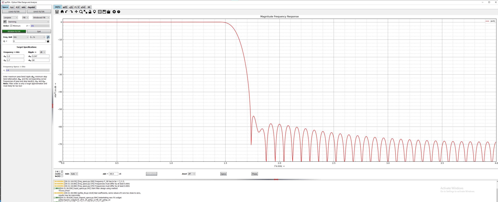
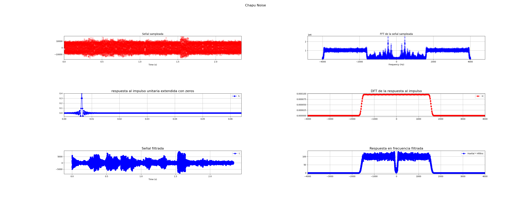

## Consigna
Dado el segmento de audio almacenado en el archivo clases/tp2/chapu_noise.npy con Fs=8000, mono de 16b y contaminado con ruido de alta frecuencia: 

### 1) Diseñe un filtro que mitigue el efecto del ruido y permita percibir mejor la señal de interés
- Se diseña un filtro pasa bajos con frecuencia de corte en 1.6kHz ya que se puede ver claramente donde comienza la señal de alta frecuencia que queremos eliminar

A continuacion se puede ver el filtro diseñado con la aplicación pyFDA


### 2) Filtre con la CIAA utilizando alguna de las técnicas vistas 
### 3) Grafique el espectro antes y después del filtro.
A continuacion se puede ver las señales antes y despues del filtro, como así tambien se ve la información del filtro.


### 4) Reproduzca el audio antes y después del filtro 
### 5) Pegue el link a un .zip comentando los resultados y los criterios utilizados, la plantilla del filtro con capturas de la herramienta de diseño y un video mostrando la CIAA/HW en acción y la reproducción de audio antes y después del filtrado.


## Código de python utilizado para mostrar la señal sampleada y los filtro
A continuación se puede ver el codigo utilizado para mostrar la señal de interes y el filtro con sus respectivos procesamientos.

```python

import ast
import numpy as np
import scipy.signal as sc
import matplotlib.pyplot as plt
from matplotlib.animation import FuncAnimation
from scipy.interpolate import interp1d

# Define the file path
file_path = "chapu_noise.npy"
T = 1

fig   = plt.figure(1)
fig.suptitle('Chapu Noise', fontsize=16)

# Frecuencia de muestro 8000Hz
fs = 8000

# Senal obtenida desde el archivo
y = np.load(file_path)[::1]
N = len(y)

# Array de t
t = np.linspace(0, N, N)/fs
xAxe  = fig.add_subplot(3,2,1)
xAxe.grid(True)
xAxe.set_xlim(0,t[-1])
xAxe.set_xlabel("Time (s)")
xAxe.set_ylim(-np.max(np.abs(y))-1000,np.max(np.abs(y))+1000)
xAxe.set_title("Señal sampleada")
xLn, = plt.plot([],[],'r-o',linewidth = 1,alpha = 0.2)
xLn.set_data(t, y)


# FFT de la señal
fft_result = np.fft.fft(y)

# Frecuencias para mostrar en la FFT
freqs = np.fft.fftfreq(len(fft_result), 1 / fs)

# # Arreglos para mostrar la senal 
xFFT  = fig.add_subplot(3,2,2)
xFFT.grid(True)
xFFT.set_xlim(-fs/2 - fs*0.1, fs/2 + fs*0.1)
xFFT.set_ylim(np.min(np.abs(fft_result)),np.max(np.abs(fft_result)) + 10)
xFFT.set_title("FFT de la señal sampleada")
xFFT.set_xlabel("Frequency (Hz)")
xLnFFT, = plt.plot([],[],'b-o',linewidth = 1,alpha = 0.2)
xLnFFT.set_data(freqs, np.abs(fft_result))


# Uso el filtro que obtuve de pyFDAx para multiplicar en frecuencia con la respuesta en frecuencia
N = 412

filterFile = 'filtro_chapu_noise.npy'
firData=np.load(filterFile).astype(float)
firData=np.insert(firData,0,firData[-1]) #ojo que pydfa me guarda 1 dato menos...
M = len(firData)

firExtendedData=np.concatenate((firData,np.zeros(N-1)))

#--------------------------------------
nData=np.arange(0,N+M-1,1)
tData=nData/fs
fData=nData*(fs/(N+M-1))-fs/2
#--------------------------------------
firAxe  = fig.add_subplot(3,2,3)
firAxe.set_title("respuesta al impulso unitaria extendida con zeros", fontsize=16)
firLn,  = plt.plot(tData,firExtendedData,'b-o',label="h")
firAxe.legend()
firAxe.grid(True)
firAxe.set_xlim(0,(N+M-2)/fs)
firAxe.set_ylim(np.min(firData),np.max(firData))

#--------------------------------------
HData         = np.fft.fft(firExtendedData)
circularHData = np.abs(np.fft.fftshift(HData/M))**2
HAxe          = fig.add_subplot(3,2,4)
HAxe.set_title("DFT de la respuesta al impulso", fontsize=16)
HLn,          = plt.plot(fData,circularHData,'r-o',label = "H")
HAxe.legend()
HAxe.grid(True)
HAxe.set_xlim(-fs/2,fs/2)

# El problemas es que la fft de chapu noise tiene 18713 puntos para representar entre -4000 y 4000 frecuencias
# y la respuesta en frecuencia del filtro tiene solamente 513 puntos
# Lo que voy a hacer es estirar la respuesta en frecuencia del filtro

# Crear una función interpoladora cúbica
interpolador = interp1d(fData, circularHData, kind='cubic')

# # Crear un nuevo conjunto de frecuencias con 18713 puntos en el mismo rango
newFreqs = np.linspace(-3998, 3984, 18713)

# # Evaluar la función interpoladora en el nuevo rango de frecuencias
newSignal = interpolador(newFreqs)

# Multiplico la respuesta en frecuencia del filtro con la respuesta en frecuencia de la signal
res = newSignal*np.abs(fft_result)
resAxe  = fig.add_subplot(3,2,6)
resAxe.set_title("Respuesta en frecuencia filtrada", fontsize=16)
firLn,  = plt.plot(newFreqs,res,'b-o',label="Hseñal * Hfiltro")
resAxe.legend()
resAxe.grid(True)
resAxe.set_xlim(-fs/2,fs/2)

# Ahora tengo que pasar al dominio del tiempo haciendo la IDFT de res
N = len(y)
t = np.linspace(0,N,N)/fs
tFiltrada = np.convolve(y, firData, mode="same")
idftAxe  = fig.add_subplot(3,2,5)
idftAxe.set_title("Señal filtrada", fontsize=16)
idftLn,  = plt.plot(t,tFiltrada,'b-o',label="t")
idftAxe.legend()
idftAxe.set_xlabel("Time (s)")
idftAxe.grid(True)


plt.tight_layout()
plt.show()

```