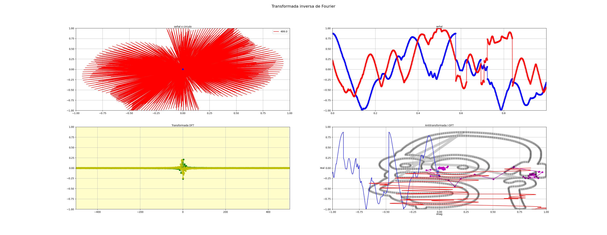
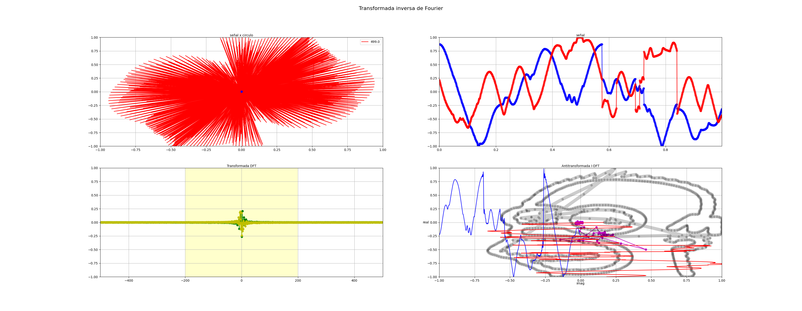

### Consignas

En el archivo clases/tp2/fft_hjs.npy se almacenaron los valores de un espectro en frecuencia correspondientes a una señal desconocida. Indique: 
1) Puede estimar que representa esta señal? (tip: grafique en 2d la idft) 
2) Hasta que punto podría limitar el ancho de banda del espectro dado en el archivo y que aun se logre interpretar la señal? 
3) Pegue el link a un pdf con los códigos y los gráficos utilizados.

### Respuestas
1) Representa la cara de Homero simpson.
2) Podria limitar hasta 400Hz de ancho de banda y todavia se ve la cara de homero pero con saltos abruptos

### Codigo 
```python

import numpy                as     np
import matplotlib.pyplot    as     plt
from   matplotlib.animation import FuncAnimation
import scipy.signal         as     sc
#--------------------------------------
fig  = plt.figure(1)
fig.suptitle('Transformada inversa de Fourier', fontsize=16)
fs   = 1000
N    = 1000
skip = 600

#-------Cargo la señal del archivo npy-------------------------------
fftData = np.load("fft_hjs.npy")[::1]
N=len(fftData)

nData = np.arange(0,N,1)
tData = nData/fs
fData = nData*(fs/((N)-(N)%2))-fs/2

# Hago la IDFT de la respuesta en frecuencia obtenida del archivo y la uso como señal
ifftData = np.fft.ifft(fftData)
fftData  = np.fft.fftshift(fftData)

def signal(f,n):
   return ifftData[n]

#--------------------------------------
nData       = np.arange(0,N,1) #arranco con numeros enteros para evitar errores de float
#--------------------------------------
circleAxe  = fig.add_subplot(2,2,1)
circleAxe.set_title("señal x circulo",rotation=0,fontsize=10,va="center")
circleLn,massLn,  = plt.plot([],[],'r-',[],[],'bo')
circleAxe.grid(True)
circleAxe.set_xlim(-1,1)
circleAxe.set_ylim(-1,1)
circleFrec = (nData-N//2)*fs/N
circleLn.set_label(circleFrec[0])
circleLg   = circleAxe.legend()
circleData = []
mass       = 0

def circle(f,n):
    return   np.exp(-1j*2*np.pi*f*n*1/fs)

def circleInv(f,n,c):
    return c*np.exp( 1j*2*np.pi*f*n*1/fs)

#--------------------------------------
signalAxe  = fig.add_subplot(2,2,2)
signalAxe.set_title("señal",rotation=0,fontsize=10,va="center")
signalRLn,  = plt.plot([],[],'b-o',linewidth=3,alpha=0.6)
signalILn,  = plt.plot([],[],'r-o',linewidth=3,alpha=0.6)
signalAxe.grid(True)
signalAxe.set_xlim(0,(N-1)/fs)
signalAxe.set_ylim(-1,1)
signalFrec = 1
signalData=[]

#--------------------------------------
promAxe  = fig.add_subplot(2,2,3)
promAxe.set_title("Transformada DFT",rotation=0,fontsize=10,va="center")
promRLn,promILn,  = plt.plot([],[],'g-o',[],[],'y-o')
promAxe.grid(True)
promAxe.set_xlim(-fs/2-fs/N,fs/2+fs/N)
promAxe.set_ylim(-1,1)
promData=np.zeros(N,dtype=complex)
promZoneLn = promAxe.fill_between([circleFrec[skip//2],circleFrec[N-1-skip//2]],100,-100,facecolor="yellow",alpha=0.2)
#--------------------------------------
inversaAxe = fig.add_subplot(2,2,4)
inversaAxe.set_title("Antitransformada I-DFT",rotation=0,fontsize=10,va="center")
inversaAxe.set_ylabel("real",rotation=0,fontsize=10,va="center")
inversaAxe.set_xlabel("imag",rotation=0,fontsize=10,va="center")
inversaLn, = plt.plot([],[],'m-o')
penLn,     = plt.plot([],[],'k-o',linewidth=10,alpha=0.2)
penRLn,    = plt.plot([],[],'b-')
penILn,    = plt.plot([],[],'r-')
inversaAxe.grid(True)
inversaAxe.set_xlim(-1,1)
inversaAxe.set_ylim(-1,1)
penData= []
#--------------------------------------
tData       = nData/fs
signalsIter = 0

def init():
    return circleLn,circleLg,signalRLn,signalILn,massLn,promRLn,promILn,inversaLn

def updateF(frecIter):
    global promData,fData,penData
    inversaData=[0]
    # input()
    for f in range(N-skip):
        inversaData.append(inversaData[-1]+circleInv(circleFrec[f+skip//2],frecIter,promData[f+skip//2]))
    inversaLn.set_data(np.imag(inversaData),np.real(inversaData))
    penData.insert(0,inversaData[-1])
    penData=penData[0:N]
    t=np.linspace(0,-1,len(penData))
    penRLn.set_data(t,np.real(penData))
    penILn.set_data(np.imag(penData),t)
    penLn.set_data(np.imag(penData),np.real(penData))
    return circleLn,circleLg,signalRLn,signalILn,massLn,promRLn,promILn,promZoneLn

def updateT(frecIter):
    global circleData,signalData,promData,circleFrec,circleLg,signalsIter

    circleData = []
    signalData = []
    for n in range(N):
        circleData.append(circle(circleFrec[frecIter],n)*signal(signalFrec,n))
        mass=np.average(circleData)
        signalData.append(signal(signalFrec,n))
        promData[frecIter]=mass
        signalRLn.set_data(tData[:n+1],np.real(signalData))
        signalILn.set_data(tData[:n+1],np.imag(signalData))
    massLn.set_data(np.real(mass),
                    np.imag(mass))
    circleLn.set_data(np.real(circleData),
                      np.imag(circleData))
    promRLn.set_data(circleFrec[:frecIter+1],np.real(promData[:frecIter+1]))
    promILn.set_data(circleFrec[:frecIter+1],np.imag(promData[:frecIter+1]))
    circleLn.set_label(circleFrec[frecIter])
    circleLg=circleAxe.legend()
    if frecIter==N-1:
        aniT._func     = updateF
        aniT._interval = 100
        signalsiter=0

    return circleLn,circleLg,signalRLn,signalILn,massLn,promRLn,promILn,promZoneLn

aniT=FuncAnimation(fig,updateT,N,init,interval=10 ,blit=False,repeat=True,cache_frame_data=False)

plt.show()
plt.close(1)

```


### Imagenes

La siguiente figura muestra la señal con un ancho de banda de completo de 1000Hz



La siguiente figura muestra la señal con un ancho de banda de 400Hz
