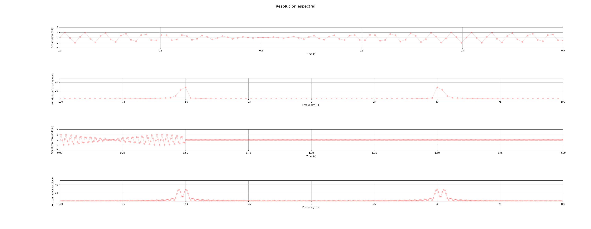
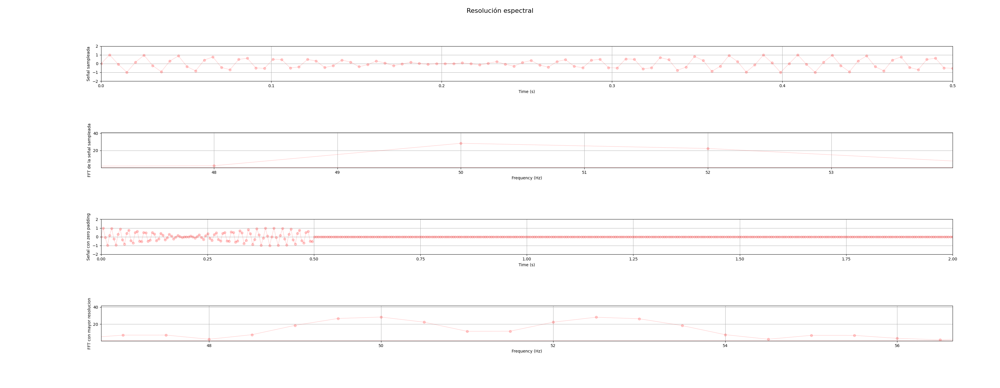

 
### Consignas

Dado el archivo clases/tp2/resolucion_espectral.txt  que contiene 100 valores reales sampleados a Fs=200Hz, indique: 
1) Resolución espectral. 
2) Espectro en frecuencia de la señal.
3) A simple inspección que frecuencia(s) distingue. 
4) Aplique alguna técnica que le permita mejorar la resolución espectral y tome nuevamente el espectro. 
5) Indique si ahora los resultados difieren del punto 3 y argumente su respuesta. 
6) Pegue el link a un pdf con los códigos, gráficos y comentarios.

### Respuestas
1)  La resolucion espectral de la señal es de R = Fs/N = 200/100 = 2Hz. Ts = 5ms
2)  Espectro en frecuencia de la señal.
3)  A simple vista se distingue la frecuencia de 50Hz.
4)  Aplico Zero padding. Agrego 300 puntos por lo que N pasa a ser 400.
5)  Los resultados difieren del punto 3 porque se puede ver claramente que las frecuencias con mayor energia son
    50Hz y 52.5Hz


### Codigo 
```python

import ast
import numpy as np
import scipy.signal as sc
import matplotlib.pyplot as plt
from matplotlib.animation import FuncAnimation

# Define the file path
file_path = "resolucion_espectral.txt"
T = 1


def get_list():
    # Open the file in read mode
    with open(file_path, "r") as file:
        # Read the contents of the file
        file_contents = file.read()

    try:
        # Parse the contents as a Python literal (in this case, a list)
        parsed_list = ast.literal_eval(file_contents)

        # Ensure that the parsed object is a list
        if isinstance(parsed_list, list):
            # print("Parsed list:", parsed_list)
            return parsed_list
        else:
            print("The file doesn't contain a list.")
            return []
    except (ValueError, SyntaxError):
        print("Error: The file does not contain a valid Python literal (list).")
        return []

fig   = plt.figure(1)
fig.suptitle('Resolución espectral', fontsize=16)

# Frecuencia de muestro 200Hz
fs = 200
N = 100

# Senal obtenida desde el archivo
y = get_list()
N = len(y)

# Array de t
t = np.linspace(0, N, N)/fs
xAxe  = fig.add_subplot(4,1,1)
xAxe.grid(True)
xAxe.set_xlim(0,t[-1])
xAxe.set_xlabel("Time (s)")
xAxe.set_ylim(-2,2)
xAxe.set_ylabel("Señal sampleada")
xLn, = plt.plot([],[],'r-o',linewidth = 1,alpha = 0.2)
xLn.set_data(t, y)


# FFT de la señal
fft_result = np.fft.fft(y)

# Frecuencias para mostrar en la FFT
freqs = np.fft.fftfreq(len(fft_result), 1 / fs)
fft_shifted = np.fft.fftshift(fft_result)

# Arreglos para mostrar la senal 
xFFT  = fig.add_subplot(4,1,2)
xFFT.grid(True)
xFFT.set_xlim(-fs/2,fs/2)
xFFT.set_ylim(np.min(np.abs(fft_shifted)),50)
xFFT.set_ylabel("FFT de la señal sampleada")
xFFT.set_xlabel("Frequency (Hz)")
xLnFFT, = plt.plot([],[],'r-o',linewidth = 1,alpha = 0.2)
xLnFFT.set_data(freqs, np.abs(fft_shifted))


N = 400
# Senal con zero padding
# Agrego 300 ceros a la senal original
zeros = np.zeros(300)
y = np.append(y, zeros)

# El nuevo t es
t = np.linspace(0, N, N)/fs

xAxe  = fig.add_subplot(4,1,3)
xAxe.grid(True)
xAxe.set_xlim(0,t[-1])
xAxe.set_xlabel("Time (s)")
xAxe.set_ylim(-2,2)
xAxe.set_ylabel("Señal con zero padding")
xLn, = plt.plot([],[],'r-o',linewidth = 1,alpha = 0.2)
xLn.set_data(t, y)


# FFT de la señal
fft_result = np.fft.fft(y)

# Frecuencias para mostrar en la FFT
freqs = np.fft.fftfreq(len(fft_result), 1 / fs)
fft_shifted = np.fft.fftshift(fft_result)

# Arreglos para mostrar la senal 
xFFTZero  = fig.add_subplot(4,1,4)
xFFTZero.grid(True)
xFFTZero.set_xlim(-fs/2,fs/2)
xFFTZero.set_ylim(np.min(np.abs(fft_shifted)),50)
xFFTZero.set_ylabel("FFT con mayor resolucion")
xFFTZero.set_xlabel("Frequency (Hz)")
xLnFFTZero, = plt.plot([],[],'r-o',linewidth = 1,alpha = 0.2)
xLnFFTZero.set_data(freqs, np.abs(fft_shifted))


plt.tight_layout()
plt.show()

```


### Imagenes

La siguiente figura muestra las señales con y sin zero padding.



La siguiente figura muestra las señales con y sin zero padding pero haciend zoom en la parte que nos interesa en la FFT.
